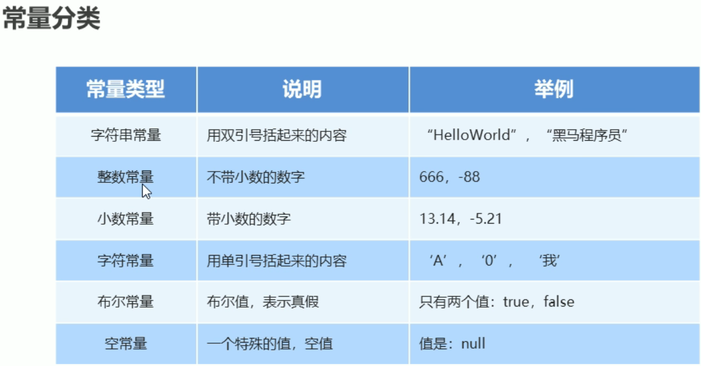

### 1.常量

在程序运行过程中，其值不可以改变的量




空常量不能被直接输出，其他类型的常量可以直接输出

System.out.println(null);   //错误，空常量不能被直接输出

### 2.标识符

标识符只能由字母，下划线_,美元符号（$）开头

标识符分为小驼峰和大驼峰命名

小驼峰是给方法和变量命名的,如firstName

大驼峰是给类命名的，如GoodStudent

### 3.数据类型


**整数默认是int**类型，**浮点数默认是double**类型

### 3.类型转换

(1)自动类型转换

把一个表示数据<u>范围小的数值或者变量</u>赋值给另一个表示<u>数据范围大的变量</u>；如：double d = 10;  <!--d值输出为10.0-->


(2)强制类型转换

把一个表示数据<u>范围大的数值或者变量</u>赋值给另一个表示<u>数据范围小的变量</u>；

格式：目标数据类型 变量 = （目标数据类型）值或者变量；

如：int k = (int)88.88;    <!--k值输出为88，丢数据了-->

### 4.运算符

#### (1)算术运算符（+、-、*、/、%）

整数操作只能得到整数，要想得到小数，必须有浮点数参与运算

```java
public class OperateDemo {
    public static void main(String[] args){
        //定义两个变量
        int a = 1;
        int b = 2;
        System.out.println(a+b);//3
        System.out.println(a-b);//-1
        System.out.println(a*b);//2
        System.out.println(a/b);//0
        System.out.println(a%b);//1
        
        System.out.println(1.0/2);//0.5
    }
}
```

#### (2)字符“+”操作

拿字符在计算机底层<u>对应的的数值</u>来进行计算的


算术表达式中包含<u>多个基本数据类型</u>的值的时候，整个算术表达式的类型会<u>自动进行提升</u>

提升规则：

byte类型，short类型和char类型将被提升到int类型

整个表达式的类型<u>自动提升</u>到表达式中<u>最高等级</u>操作数同样的类型


```java
public class ConversionDemo002 {
    public static void main(String args[]){
        char a = 'A';//A的值是65
        int b = 10;
        int c=a+b; //结果提升到int类型
        System.out.println(c);//c的值是75
    }
}
```

#### (3)字符串的“+”操作

当“+”操作中出现字符串时，这个“+”是字符串连接符，而不是算术运算符；如：“itheima"+666 <!--输出结果为itheima666-->

在“+”操作中，如果出现了字符串，就是连接运算符，否则就是算术运算。当连续进行“+”操作时，从左到右逐个执行。如：1+99+"年黑马"<!--输出结果为100年黑马-->

#### (4)赋值运算符


注意：（红色标记）扩展的赋值运算符**隐含**了强制类型转换

short s = 10;

s =(short) s+20;相当于 s += 20;  

#### (5)自增自减运算符


单独使用的时候，++和--无论放在变量的前边还是后边，结果是一样的。如：i++;     ++i;【**最常用的用法**】

++或者--参与操作的时候，如果放在变量的后边，先拿变量参与操作，后拿变量做++或者--。如：int i=10；int j = **i++**;j输出值为10【先赋值后加1或者减1】

++或者--参与操作的时候，如果放在变量的前边，先拿变量做++或者--，后拿变量参与操作。如：int i=10；int j = **++i**;j输出值为11【先加1或者减1后赋值】

#### (6)关系运算符


关系运算符的结果都是boolean类型，要么是true,要么是false。

千万不要把“==”误写成“=”

#### (7)逻辑运算符


逻辑运算符，是用来**连接关系表达式**的运算符。如x>3&&x<6

逻辑运算符可以直接**连接布尔类型的常量或者变量**。

逻辑与& 两个都为true，则true

逻辑与|有一个为true，则true

逻辑异或 ^ 不同为true，相同为false

#### (8)短路逻辑运算符


逻辑与**&**，无论左边真假，右边都要执行。

短路与**&&**，如果左边为真，右边执行；如果**左边为假，右边不执行**。

逻辑或**|**，无论无论左边真假，右边都要执行。

短路或**||**，如果左边为假，右边执行；如果**左边为真，右边不执行**。

最常用的逻辑运算符：&&，||，！

#### (9)三元运算符

格式：关系表达式**？**表达式1**：**表达式2；

范例：**a>b?a:b**;

计算规则：

​	首先计算**关系表达式的值**

​	如果值为**true,表达式1的值**就是运算结果

​	如果值为**false,表达式2的值**就是运算结果

### 5.三元运算符运用

(1)两只老虎的体重分别是180kg和200kg,请用程序实现判断两只老虎的体重是否相同。

```java
public static void main(String[] args) {
        int trigger1 = 180;
        int trigger2 = 200;
//        boolean c= trigger1==trigger2?true:false;
//        if(c){
//            System.out.println("两只老虎体重相等");
//        }else{
//            System.out.println("两只老虎体重不相等");
//        }
        System.out.println(trigger1==trigger2?"两只老虎体重相等":"两只老虎体重不相等");
    }
```

(2)三个和尚的身高分别为150cm、210cm、165cm,请用程序实现这三个和尚的最高身高

```java
public static void main(String[] args) {
        int heshang1 = 150;
        int heshang2 = 210;
        int heshang3 = 165;
        int tempMax = heshang1 > heshang2 ? heshang1 : heshang2;
        int max=tempMax>heshang3?tempMax:heshang3;
        System.out.println(max);

    }
```

### 6.数据输入

```java
import java.util.Scanner;//1.导包

public class ScannerDemo {
    public static void main(String[] args) {
        //2.创建对象
        Scanner sc = new Scanner(System.in);
        //3.接收数据
        int x = sc.nextInt();
        //输出对象
        System.out.println("x"+x);
    }
}
```

（1）三个和尚，身高必须经过测量得出，请用程序实现这三个和尚的最高身高

```java
public static void main(String[] args) {
        //身高未知，采用键盘录入实现，首先导包，然后创建对象
        Scanner sc = new Scanner(System.in);

        //键盘录入三个身高分别赋值给三个变量
        System.out.println("请输入第一个和尚的身高：");
        int height1 = sc.nextInt();

        System.out.println("请输入第二个和尚的身高：");
        int height2 = sc.nextInt();

        System.out.println("请输入第三个和尚的身高：");
        int height3 = sc.nextInt();

        //用三元运算符获取前两个和尚的较高身高值，并用临时身高变量保存起来
        int tempHeight = height1 > height2?height1:height2;

        //用三元运算符获取身高值和第三个和尚身高较高值，并用最大身高变量保存
        int maxHeight = tempHeight > height3?tempHeight:height3;
        //输出对象
        System.out.println("最高身高："+maxHeight);
    }
```

### 7.if语句

任意给出一个整数，请用程序实现判断该整数是奇数还是偶数，并在控制台输出该整数是奇数还是偶数

```java
public static void main(String[] args) {
    Scanner sc = new Scanner(System.in);
    System.out.println("请输入该整数:");
    int number=sc.nextInt();
    if(number%2==0){
        System.out.println(number+"该整数是偶数");
    }else{
        System.out.println(number+"该整数是奇数");
    }
}
```

### 8.switch语句

switch(表达式){

​	case 值1：

​					语句体1；

​					break;

​	case 值2：

​					语句体2；

​					break;

​	...

​	default：

​					语句体n+1；

​					break;

}

执行流程：

（1）首先计算表达式的值

（2）依次和case后面的值进行比较，如果有对应的值，就会执行相应的语句，在执行的过程中，遇到break就会结束。

（3）如果所有的case后面的值和表达式的值都不匹配，就会执行default里面的语句体，然后程序结束掉。

```java
public static void main(String[] args) {
    Scanner sc = new Scanner(System.in);
    System.out.println("请输入：");
    while(true) { //控制循环输入
        String week = sc.next();
        switch (week) {
            case "1":
                System.out.println("今天是星期一");
                break;
            case "2":
                System.out.println("今天是星期二");
                break;
            case "3":
                System.out.println("今天是星期三");
                break;
            case "4":
                System.out.println("今天是星期四");
                break;
            case "5":
                System.out.println("今天是星期五");
                break;
            case "6":
                System.out.println("今天是星期六");
                break;
            case "7":
                System.out.println("今天是星期日");
                break;
            case "quit":
                System.out.println("谢谢使用，程序退出");
                break;
            default:
                System.out.println("输入错误");
                break;
        }
        if("quit".equals(week)){ //控制结束循环
            break;
        }
    }
}
```

题目练习：一年有12个月，分属于四个季节，键盘录入一个月份，请用程序实现判断该月份属于哪个季节，并输出

**注意事项**：在switch语句中，如果case控制的语句体后面不写break,将出现穿透现象，在不判断下一个case值的情况下，向下运行，直到遇到break,或者整体switch语句结束。

```java
public static void main(String[] args) {
    Scanner sc  = new Scanner(System.in);
    System.out.println("请输入月份,如要退出请输入100");
    while (true){
        int month = sc.nextInt();
        //1、2、12冬季
        //3、4、5春季
        //6、7、8夏季
        //9、10、11秋季
        switch(month){
            case 1:
            case 2:
            case 12:
                System.out.println("冬季");
                break;//跳出switch语句
            case 3:
            case 4:
            case 5:
                System.out.println("春季");
                break;
            case 6:
            case 7:
            case 8:
                System.out.println("夏季");
                break;
            case 9:
            case 10:
            case 11:
                System.out.println("秋季");
                break;
            default:
                System.out.println("您输入的月份有误");
                break;
        }
        if(month==100){
            System.out.println("结束此次循环，谢谢光临");
            break;
        }
    }

}
```

### 9.for循环


(1)在控制台输出5次HelloWorld!

```java
public static void main(String[] args) {
    //在控制台输出5次HelloWord!
    for(int i = 0;i<5;i++){
        System.out.println("HelloWorld!");
    }
}
```

(2)在控制台输出1-5和5-1的语句

```java
//输出1-5
for(int a = 1;a<=5;a++){
    System.out.println(a);
}
System.out.println("-------------");
//输出5-1
for(int b = 5;b>=1;b--){
    System.out.println(b);
}
```

(3)求1-5之间的数据和，并把求和结果在控制台输出

```java
int sum = 0;
for(int i = 1;i<=5;i++){
    sum += i;//sum=sum+i
}
System.out.println("1-5的数据加和："+sum);
```

(4)求1-100之间的偶数和，并把求和结果在控制台输出

```java
//求1-100之间的偶数和，并把求和结果在控制台输出
int ouSum = 0;
for(int i = 1;i<=100;i++){
    if(i%2==0){//偶数
        ouSum += i;//ouSum=ouSum+i
    }
}
System.out.println("1-100之间的偶数和是："+ouSum);
```

### 10.for循环-水仙花数


（1)需求：在控制台输出所有的”水仙花数“


```java
for(int i = 100;i<1000;i++){
    int a = i%10;//个位数
    int b = i/10%10;//十位数
    int c = i/100;//百位数
    if(a*a*a+b*b*b+c*c*c==i){
        System.out.println(i);//153、370、371、407
    }
}
```

（2）需求：统计“水仙花数”一共有多少个，并在控制台输出个数

```java
int count = 0;
for(int i = 100;i<1000;i++){
    int a = i%10;//个位数
    int b = i/10%10;//十位数
    int c = i/100;//百位数
    if(a*a*a+b*b*b+c*c*c==i){
        count++;
    }
}
System.out.println("水仙花数的个数为："+count);
//水仙花数的个数为：4
```

### 11.while循环语句


（1）在控制台输出5次HelloWorld!

```java
public static void main(String[] args) {
    //在控制台输出5次HelloWorld!
    //for循环实现
    for(int i = 0;i<5;i++){
        System.out.println("HelloWorld!");
    }
    System.out.println("--------");
    
    //while循环实现
    int j=1;//1.初始化语句
    while(j<=5){//2.条件判断语句
        System.out.println("HelloWorld!");//3.循环体语句
        j++;//4.条件控制语句
    }
}
```

### 12.while循环-珠穆朗玛峰

需求：世界上最高山峰是珠穆朗玛峰（8848.43米=8844430毫米），假如我有一张足够大的纸，它的厚度是0.1毫米。请问，我折叠多少次，可以折成珠穆朗玛峰的高度？

```java
public static void main(String[] args) {
    //世界上最高山峰是珠穆朗玛峰（8848.43米=8844430毫米），假如我有一张足够大的纸，它的厚度是0.1毫米。
    // 请问，我折叠多少次，可以折成珠穆朗玛峰的高度
    //折叠1次，0.1*2
    //折叠2次，0.1*2*2
    //折叠3次，0.1*2*2*2
    int count = 0;//定义一个计数器，初始值为0
    double paper = 0.1;//定义纸张厚度
    int zf = 8844430;//定义珠穆朗玛峰的高度
    while(paper<=zf){
        paper *= 2;//*=隐含强制类型转换
        count++;
    }
    System.out.println("需要折叠："+count+"次");
}
```

### 13.do...while循环语句


（1）在控制台输出5次HelloWorld!

```java
public static void main(String[] args) {
    //需求：在控制台输出5次"HelloWorld!"
    //for循环实现
    for(int i = 0;i<5;i++){
        System.out.println("HelloWorld!");
    }
    
    System.out.println("--------");
    
    //do...while循环实现
    int j = 0;//初始化语句
    do{
        System.out.println("HelloWorld!");
        j++;
    }while(j<5);
}
```

### 14.三种循环的区别


### 15.跳转控制语句(continue/break)

**continue**用于循环中，基于条件控制，跳过某次循环体内容的执行，继续下一次的执行

**break** 用在循环中，基于条件控制，终止循环体内容的执行，也就是说结束当前的整个循环

```java
public static void main(String[] args) {
    for(int i=1;i<=5;i++){
        if(i%2==0){//是否偶数
            continue;//跳过某次循环，继续下一次循环 
        }
        System.out.println(i);//跳过偶数，输出1、3、5
    }  
}
```

```java
for(int i=1;i<=5;i++){
    if(i%2==0){//是否偶数
        break;//终止循环
    }
    System.out.println(i);//遇到偶数，终止循环，只输出1
}
```

### 16.循环嵌套

在控制台输出一天的小时和分钟

```java
public static void main(String[] args) {
    //在控制台输出一天的小时和分钟
    //分钟：0<=minute<60
    //小时：0<=hour<24
    //外循环控制小时的范围，内循环控制分钟的范围
    for(int hour = 0;hour<24;hour++){
        for(int minter=0;minter<60;minter++){
            System.out.println(hour+"时"+minter+"分");
        }
    }
}
//输出结果：
    0时0分
    0时1分
    0时2分
    ...
    0时59分
    1时0分
    ...
    23时59分
```

### 17.Random

用于产生一个随机数 


(1)

```java
import java.util.Random;//1.导包
public class RandomDemo {
    public static void main(String[] args) {
       Random r = new Random();//2.创建对象
        //用循环获取10个随机数
        for(int i=0;i<10;i++){
            int number = r.nextInt(10);//获取随机数
            System.out.println("number"+number);
        }
        System.out.println("--------");
        //需求：获取一个1-100之间的随机数
        int num = r.nextInt(100)+1;//0-99,不包括100，可+1
        System.out.println("num:"+num);
    }
}
```

(2)程序自动生成一个1-100之间的数字，使用程序实现猜出这个数字是多少？

```java
//程序自动生成一个1-100之间的数字，使用程序实现猜出这个数字是多少？
//猜的数字比真实数字大，提示猜大了
//猜的数字比真实数字小，提示猜小了
//猜的数字与真实数字相等，提示猜中了
Random random = new Random();
int factNum = random.nextInt(100)+1;
System.out.println("生成的随机数为:"+factNum);
while (true){
    Scanner sc = new Scanner(System.in);
    System.out.println("请输入你要猜的数字：");
    int guessNum = sc.nextInt();
    if(guessNum>factNum){
        System.out.println("你猜的数字"+guessNum+"大了");
    }else if(guessNum<factNum){
        System.out.println("你猜的数字"+guessNum+"小了");
    }else{
        System.out.println("猜中了");
        break;
    }
}
```

### 18.IDEA创建程序步骤


### 19.数组

#### （1）数组定义格式

数组（array)是一种用于存储**多个**`相同类型`数据的存储模型


**备注：推荐使用格式一**

#### （2）数组动态初始化

- ##### 数组初始化概述

​		java中的数组必须先初始化，然后才能使用

​		所谓初始化：就是为数组中的数组元素分配内存空间，并为每个数组元素赋值

- ##### 数组初始化方式

  分为**动态初始化**和**静态初始化**

  **动态初始化**：**初始化时只指定数组长度，由系统为数组分配初始值**

  格式：数据类型[] 变量名 = new 数据类型[数组长度]；

  范例：int[] arr = new int[3];

  

  

  ```java
  public static void main(String[] args) {
      int[] arr = new int[3];
      /*
      左边：
          int:说明数组中的元素类型是int类型
          []:说明这是一个数组
          arr:这是数组的名称
      右边：
          new：为数组申请内存空间
          int：说明数组中的元素类型是int类型
           []:说明这是一个数组
            3:数组长度，其实就是数组中的元素个数
       */
  }
  ```

#### （3）数组元素访问


```java
public static void main(String[] args) {
    int[] arr = new int[3];
    /*
    左边：
        int:说明数组中的元素类型是int类型
        []:说明这是一个数组
        arr:这是数组的名称
    右边：
        new：为数组申请内存空间
        int：说明数组中的元素类型是int类型
         []:说明这是一个数组
          3:数组长度，其实就是数组中的元素个数
     */
    //输出数组名
    System.out.println(arr);//[I@1b6d3586
    
    //输出数组中的元素
    System.out.println(arr[0]);//输出0,系统为数组分配初始值
    System.out.println(arr[1]);//输出0,系统为数组分配初始值
    System.out.println(arr[2]);//输出0,系统为数组分配初始值
}
```

#### （4）内存分配

- **java中的内存分配**

  java程序在运行时，需要在内存中分配空间。为了提高运算效率，就对空间进行了不同区域的划分，因为每一片区域都有特定的处理数据方式和内存管理方式。

  

  


#### （5）单个数组内存图


```java
public static void main(String[] args) {
        //定义一个数组
        int[] arr = new int[3];
        
        //输出数组名及元素
        System.out.println(arr);//输出[I@1b6d3586
        System.out.println(arr[0]);//输出0
        System.out.println(arr[1]);//输出0
        System.out.println(arr[2]);//输出0
        
        //给数组中的元素赋值
        arr[0] = 100;
        arr[2] = 200;
        
        //再次输出数组名及元素
        System.out.println(arr);//输出[I@1b6d3586
        System.out.println(arr[0]);//输出100
        System.out.println(arr[1]);//输出0
        System.out.println(arr[2]);//输出200
    }
```

#### （6）多个数组内存图


```java
public static void main(String[] args) {
    //定义两个数组
    int[] arr = new int[2];
    int[] arr2 = new int[3];

    //分别输出数组名及元素
    System.out.println(arr);//输出内存地址：[I@1b6d3586
    System.out.println(arr[0]);//输出0
    System.out.println(arr[1]);//输出0

    System.out.println(arr2);//输出内存地址：[I@4554617c
    System.out.println(arr2[0]);//输出0
    System.out.println(arr2[1]);//输出0
    System.out.println(arr2[2]);//输出0

    //分别给元素赋值
    arr[0] = 100;
    arr2[0] = 200;
    arr2[2] = 300;

    //分别再次输出两个数组名及元素
    System.out.println(arr);//输出内存地址：[I@1b6d3586
    System.out.println(arr[0]);//输出100
    System.out.println(arr[1]);//输出0

    System.out.println(arr2);//输出内存地址：[I@4554617c
    System.out.println(arr2[0]);//输出200
    System.out.println(arr2[1]);//输出0
    System.out.println(arr2[2]);//输出300
}
```

#### （7）多个数组指向相同内存图


注意：**当两个数组指向相同内存时，任何一个数组修改堆内存的数据，另一个数组去访问时元素值也是发生改变的。**

#### （8）数组静态初始化  


推荐简化格式，虽然省略了new,但是仍然开辟了内存空间。

```java
public static void main(String[] args) {
    //定义数组
    int[] arr = {1,2,3};

    //输出数组名
    System.out.println(arr);//输出内存空间：[I@1b6d3586

    //输出数组中的元素
    System.out.println(arr[0]);//输出:1
    System.out.println(arr[1]);//输出:2
    System.out.println(arr[2]);//输出:3
}
```

#### （9）数组操作的两个常见小问题

- **索引越界**：访问了数组中不存在的索引对应的元素，造成索引越界问题（控制台输出：ArrayIndexOutOfBoundsException）
- **空指针异常**：访问的数组已经不再指向堆内存的数据，造成空指针异常（控制台输出：NullPointerException）
- null:空值，引用数据类型的默认值，表示不指向任何有效对象


#### （10）遍历

- **获取数组元素数量**

  格式：数组名.length

  范例：arr.length

- **遍历通用格式**

  ```java
  int[] arr = {......};
  for(int x=0;x<arr.length;x++){
  	arr[x];
  }
  ```

  ```java
  public static void main(String[] args) {
      //定义数组
      int[] arr = {1,2,3,4,5};
      //使用通用的遍历格式
      for(int i =0;i<arr.length;i++){
          System.out.println(arr[i]);
      }
  }
  ```

#### （11）获取最大值

```java
public static void main(String[] args) {
    int[] arr = {1,3,6,9,5};
    //定义一个变量，用于保存最大值（或最小值）
    int max = arr[0];//取数组中第一个数据作为变量初始值
    //与数组中剩余的数据逐个比对，每次比对将最大值保存到变量中
    for(int x = 1;x<arr.length;x++){
        if(arr[x]>max){
            max=arr[x];
        }
    }
    //循环结束后打印变量的值
    System.out.println("最大值是:"+max);//9
}
```

### 20.方法

#### （1）方法概述

**方法**（method)是将具有独立功能的代码快组织成为一个整体，使其具有特殊功能的代码集

**注意**：

方法必须先创建才可以使用，该过程称为方法定义

方法创建后并不是直接运行的，需要手动使用后才执行，该过程称为方法调用

#### （2）方法的定义和调用

- **方法定义**

  格式：

```java
public static void 方法名() {
   //方法体
}
```

​	  范例：

```java
public static void isEvenNumber() {
   //方法体
}
```

- **方法调用**

格式：方法名();

范例：isEvenNumber();

**注意：**

方法必须先定义后调用，否则程序将报错

```java
public static void main(String[] args) {
    //调用方法
    isEvenNumber();
}
//需求：定义一个方法，在方法中定义一个变量，判断该数据是否是偶数
public static void isEvenNumber() {
    int num = 10;
    if (num % 2 == 0) {
        System.out.println(true);
    } else {
        System.out.println(false);
    }
}
```


####  （3）方法练习

需求：设计一个方法用于打印两个数中的较大值

```java
public static void main(String[] args) {
    //调用方法
    getMax();
}
//需求：设计一个方法用于打印两个数中较大值
//定义一个方法，用于打印两个数字中的较大数
public static void getMax(){
    //方法中定义两个变量，用于保存两个数字
    int a=10;
    int b = 20;
    //使用分支语句分两种情况对两个数字的大小关系进行处理
    if(a>b){
        System.out.println(a);
    }else{
        System.out.println(b);
    }
}
```

#### （4）带参数方法的定义和调用

**注意：**

- 方法定义时，参数中的**数据类型**与**变量名**都不能缺少，缺少任意一个程序将报错
- 方法定义时，多个参数之间使用逗号（，）分隔

```java
格式：public static void 方法名(参数){... ...}
格式（单个参数）：public static void 方法名(数据类型 变量名){... ...}
范例（单个参数）：public static void isEventNumber(数据类型 变量名){... ...}
格式（多个参数）：public static void 方法名(数据类型 变量名1,数据类型 变量名2,......){... ...}
范例（多个参数）：public static void getMax(int number1,int number1){... ...}
```

```java
方法调用格式：方法名（参数）

格式（单个参数）：方法名（变量名/常量值）；
范例（单个参数）：isEventNumber(5);

格式（多个参数）：方法名（变量名1/常量值1，变量名2/常量值2）；
范例（多个参数）：getMax(5,6)；
```

**注意：**

- 方法调用时，参数的数量与类型必须与方法定义中的设置相匹配，否则程序将报错

#### （5）形参和实参

形参：方法定义中的参数

​			等同于变量定义格式，例如：int number 

实参：方法调用中的参数

​			等同于使用变量或常量，例如：10   number

#### （6）带返回值方法定义和调用

- 带返回值方法定义格式：

```java
public static 数据类型 方法名(参数){
    return 数据;
}
```

注意：方法定义时**return后面的返回值**与方法定义上的**数据类型**要匹配，否则程序将报错

- 带返回值方法调用格式1：方法名(参数);   范例：isEvenNumber(5);

- 带返回值方法调用格式2：**数据类型  变量名** = 方法名(参数); 范例：boolean flag =  isEvenNumber(5);

注意：

方法的返回值通常会使用变量接收，否则该返回值将无意义

```java
public static void main(String[] args) {
    //调用方法
    int max = getMax(10,20);//使用变量保存
    System.out.println(max);
    
    System.out.println(getMax(10,20));//直接打印结果
}
//定义一个方法可以获取两个数的较大值，数据来源于参数
public static  int getMax(int a,int b){
    if(a>b){
        return a;
    }else{
        return b;
    }
}
```

#### （7）方法注意事项

- 方法不能嵌套定义

- void表示无返回值，可以省略return,也可以单独书写return，后面不加数据
- 方法执行到return就结束了，不会往下执行，下面的语句书写会报错

#### （8）方法通用格式

- 格式：public static **返回值类型** 方法名(参数){

​					方法体；

​					return **数据**；

}

- 定义方法时，要做到两个两个明确

    (一）明确返回值类型，主要明确方法操作完毕之后是否有数据返回，如果没有，写void;如果有，写对应的数据类型，

  （二）明确参数：主要是明确参数的类型和数量

- 调用方法时,void类型的方法，直接调用即可；非void类型的方法，推荐用变量接收调用

- public static	修饰符

- 返回值类型	  方法操作完毕之后返回的数据的数据类型

  ​						  如果方法操作完毕，没有数据返回，这里写void；而且方法体一般不写return				

- 方法名			  调用方法时候使用的标识	

- 参数 				 由数据类型和变量名组成，多个参数用逗号隔开

- 方法体 			 完成功能的代码块

- return 			 如果方法操作完毕，有数据返回，用于把数据返回给调用者

#### （9）方法重载

方法重载指同一个类中定义的多个方法之间的关系，满足下列条件的多个方法相互构成重载

- 多个方法在同一个类中

- 多个方法具有**相同的方法名**

- 多个方法的**参数不相同**（**类型不同**或者**数量不同**）

- **重载仅对应方法的定义**，与方法的调用无关，调用方式参照标准格式，在调用的时候，java虚拟机会通过参数的不同来区分同名的方法

- **重载仅针对同一个类中方法的名称与参数进行识别**，与返回值无关，换句话说不能通过返回值来判定两个方法是否相互构成重载

  需求：使用方法重载的思想，设计比较两个整数是否相同的方法，兼容全整数类型（byte,short,int,long)

```java
public class ChongzaiTest {
    public static void main(String[] args) {
        System.out.println(compare(10,20));
        System.out.println(compare((byte)10,(byte)20));
        System.out.println(compare((short)10,(short)20));
        System.out.println(compare(10L,20L));
    }
    //int
    public static boolean compare(int a,int b){
        System.out.println("int");
        return a==b;
    }
    //byte
    public static boolean compare(byte a,byte b){
        System.out.println("byte");
        return a==b;
    }
    //short
    public static boolean compare(short a,short b){
        System.out.println("short");
        return a==b;
    }
    //long
    public static boolean compare(long a,long b){
        System.out.println("long");
        return a==b;
    }
}
```

#### （10）方法参数传递

- **基本类型**

  对于**基本数据类型**的参数，**形式参数的改变，不影响实际参数的值** 

  

  

```java
public static void main(String[] args) {
    int number = 100;
    System.out.println("调用change方法前："+number);//调用change方法前：100
    change(number);
    System.out.println("调用change方法后："+number);//调用change方法后：100
}
public static void change(int number){
    number = 200;
}
```

- **引用类型**

  对于**引用类型**的参数，**形式参数的改变，影响实际参数的值**

  

  

- **数组遍历**

  ```java
  public static void main(String[] args) {
          //设计一个方法用于数组遍历,要求遍历的结果是在一行上的。例如:[11,22,33,44,55]
          int[] arr01 = {11,22,33,44,55};//定义一个数组，用静态初始化完成数组元素初始化
          String s = bianliArr(arr01);//调用方法，用变量接收返回结果
          System.out.println(s);
      }
  public static String  bianliArr(int[] arr01){//返回值类型:String  参数:int[] arr
          String s = "[";
          for(int i = 0;i<arr01.length;i++){
              if(i==arr01.length-1){
                  s+=arr01[i];
              }else{
                  s+=arr01[i]+",";
              }
          }
          s=s+"]";
          return s;
      }
  ```

- **数组最大值**

```java
public static void main(String[] args) {
    //设计一个方法用于获取数组中元素的最大值，调用方法并输出结果
    int[] arr02 = {1,3,6,3,2,1,8,5};
    int max = getMax(arr02);//调用获取最大值方法，用变量接收返回值结果
    System.out.println(max);
}
public static  int getMax(int[] arr){ //返回值类型:int  参数:int[] arr
    int max = arr[0];
    for(int x = 0;x<arr.length;x++){
        if(max<arr[x]){
            max =  arr[x];
        }
    }
    return max;
}
```

### 21.Debug使用

如果数据来源于键盘输入，一定要记住输入数据，不然就不能继续往下查看了（F7)

### 22.逢7过练习

```java
public static void main(String[] args) {
        //1-100之间的满足逢7必过规则的数据(包含7或者是7的倍数）
        String s = "";
        int[] arr = {};
        for(int i = 1;i<=100;i++){
            if(i%7==0){
                s+=i+" ";
                continue;//跳出本次本次循环，继续下次循环[避免和包含7的重复输出]
            }
            if((i+"").contains("7")){
                s+=i+" ";
                continue;
            }
        }
        System.out.println(s);
    }
```

### 23.生兔子

```java
//有一对兔子，从出生后第三个月起每个月都生一对兔子，小兔子长到第三个月后每个月又生一对兔子，假如兔子都不死，问第20个月的兔子对数是多少
/*第1个月：  1
  第2个月：  1
  第3个月：  2
  第4个月：  3
  第5个月：  5*/
public static void main(String[] args) {
    //为了存储多个月的兔子对数，定义一个数组，用哪个动态初始化完成数组元素的初始化，数组长度为20
    int[] arr = new int[20];

    //第1个月和第2个月兔子的对数已知，都是1
    arr[0]=1;
    arr[1]=1;
    for(int i = 2;i<arr.length;i++){
        arr[i]=arr[i-2]+arr[i-1];
    }
    //输出数组中最后一个元素的值=第20个月兔子对数
    System.out.println("第二十个月的兔子的对数是："+arr[19]);
}
```

### 24.百钱百鸡

```java
//需求：在我国古代数学张丘建在《算经》一书中提出的数学问题：
//鸡翁一值钱五，鸡母一值钱三，鸡雏三值钱一，
//百钱买百鸡，问鸡翁、鸡母、鸡雏各几何？
/*
鸡翁：x  5x
鸡母；y  3y
鸡雏：z  1/3z
x+y+z=100
5x+3y+1/3z=100
0<=x<=20
0<=y<=33
0<=z<=100
*/
public class Chicken {
    public static void main(String[] args) {
        for(int x=0;x<=20;x++){//鸡翁
            for(int y=0;y<=33;y++){//鸡母
                int z = 100-x-y;//鸡雏
                if(z%3==0&&5*x+3*y+z/3==100){
                    System.out.println(x+","+y+","+z);
                }
            }
        }
    }
}
```

### 25.数组元素求和

```java
public static void main(String[] args) {
    /*有这样的一个数组，元素是（68, 27, 95, 88, 171, 996, 51, 210）,求出数组中满足要求的元素和，要求是：求和的元素
    个位和十位都不能是7，并且只能是偶数*/
    int[] arr={68, 27, 95, 88, 171, 996, 51, 210};
    int sum = 0;
    for(int i = 0;i<arr.length;i++){
       int ge = arr[i]%10;
       int shi = arr[i]%10/10;
       if(ge!=7&&shi!=7&&arr[i]%2==0){
           sum += arr[i];
       }
    }
    System.out.println("sum:"+sum);
}
```

### 26.数组内容是否相同

```java
public static void main(String[] args) {
    //定义两个数组，用于比较两个数组的内容是否相同
    int[] arr1={11,22,33,44,55};
    int[] arr2={11,22,33,44,55};
    boolean flag = compare(arr1,arr2);
    System.out.println(flag);
}
public static boolean compare(int[] arr1,int[] arr2) {
    //首先比较数组长度，如果长度不相同，内容肯定不相同，返回false
    if (arr1.length != arr2.length) {
        return false;
    }
    //其次遍历数组中的每一个元素,只要有元素不相同，则返回false
    for(int x = 0;x<arr1.length;x++){
        if(arr1[x]!=arr2[x]){
            return false;
        }
    }
    return true;
}
```

27.反转

```java
//已知一个数组arr={19,28,37,46,50};用程序实现把数组中的元素值交换
//交换后的数组arr={50,46,37,28,19};并在控制台输出交换后的数组元素
public class FanZhuan {
    public static void main(String[] args) {
        int[] arr={19,28,37,46,50};
        reserve(arr);//调用反转的方法
        printArr(arr);//遍历数组
    }
    public static void reserve(int[] arr) {
        //循环遍历数组，初始化语句定义两个索引变量，判断条件：开始索引<=结束索引
        for(int start=0,end = arr.length-1;start<=end;start++,end--){
            int temp = arr[start];
            arr[start]=arr[end];
            arr[end]= temp;
        }
    }
    public static void printArr(int[] arr){
        System.out.print("[");
        for(int i = 0;i<arr.length;i++){
            if(i==arr.length-1){
                System.out.print(arr[i]);//最后一个元素，不加“，”
            }else{
                System.out.print(arr[i]+",");
            }
        }
        System.out.println("]");
    }
}
```

### 27.类和对象

类是对现实生活中一类具有共同属性和行为的事物的抽象

类的特点：

（1）类是对象的数据类型

（2）类是具有相同属性和行为的一组对象的集合

对象是能够看得到摸得着的真实存在的实体


**创建对象**

格式：类名 对象名 = new 类名（）；

范例：Phone p = new Phone();

### 28.单个对象内存图


方法执行完成后会从栈内存消失

### 29.多个对象内存图


### 30.多个对象指向相同


