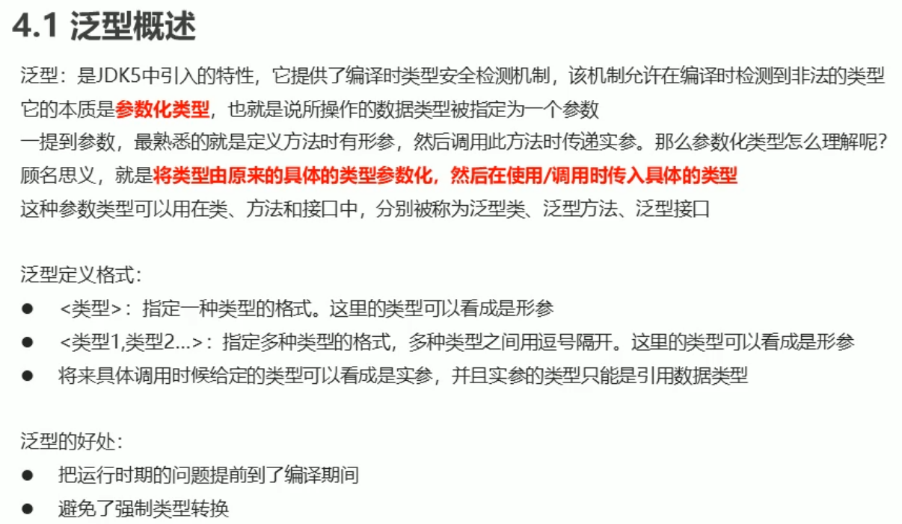
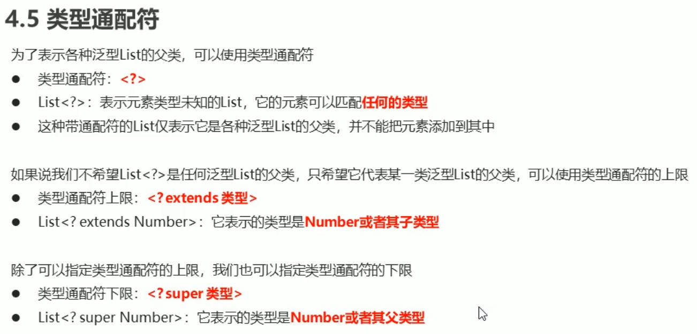
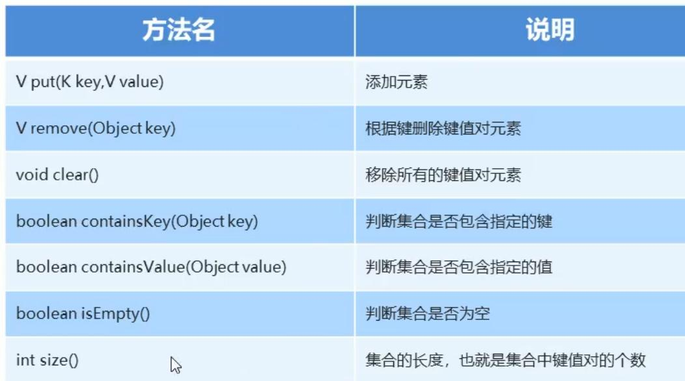
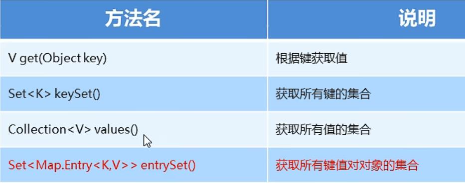

### 80、异常

#### （1）异常概述

异常：就是程序出现了不正常的情况


Error:严重问题，不需要处理

Exception:称为异常类，它表示程序本身可以处理的问题

- RuntimeException:在编译期是不检查的，出现问题后，需要我们回来修改代码
- 非RuntimeException:编译期就必须处理的，否则程序不能通过编译，就更不能正常运行了

#### （2）JVM的默认处理方案

如果程序出现了问题，我们没有做任何处理，最终JVM会做默认的处理

- 把异常的名称，异常原因及异常出现的位置等信息输出在了控制台
- 程序停止执行

#### （3）异常处理之try...catch

因为默认的JVM处理方案程序会直接结束掉，实际上程序出现异常不应该影响后续的执行，所以异常需要自己处理

如果程序出现了问题，我们需要自己来处理，有两种方案：

- try...catch...

  ```java
  格式：
  try{
  ​		可能出现异常的代码；
  }catch(异常类名 变量名){
  ​		异常的处理代码；
  }
  执行流程：
  程序从try里面的代码开始执行
  出现异常，会自动生成一个异常类对象，该异常对象将被提交给Java运行时系统
  当Java运行时系统接收到异常对象时，会到catch中去找匹配的异常类，找到后进行异常的处理
  执行完毕之后，程序还可以继续往下执行
  ```

- throws

#### （4）throwable的成员方法


e.getMessage():返回的是异常的原因

e.toString():返回的是异常的类名和原因

e.printStackTrace():输出的是异常的类名、原因和异常的代码位置     <font color = 'red'>一般使用此方法</font>

```java
public class ExceptionDemo001 {
        public static void main(String[] args) {
            System.out.println("开始");
            method();
            System.out.println("结束");
        /*输出结果：
        开始
        java.lang.ArrayIndexOutOfBoundsException: 3
		at com.myMethod.ExceptionDemo001.method(ExceptionDemo001.java:18)
		at com.myMethod.ExceptionDemo001.main(ExceptionDemo001.java:6)
        结束*/
        }
        public static void method(){
            try {
                int[] arr = {1,2,3};
                System.out.println(arr[3]);//new ArrayIndexOutOfBoundsException
            } catch (ArrayIndexOutOfBoundsException e) {
                e.printStackTrace();
            }
        }
}
```

#### （5）编译时异常和运行时异常的区别

Java中的异常被分为两大类：编译时异常和运行时异常，也被称为受检异常和非受检异常

所有的RuntimeException类及其子类被称为运行时异常，其他的异常都是编译时异常

- 编译时异常：必须显示处理，否则程序就会发生错误，无法通过编译 <font color = 'red'>（程序提示有可能出现异常，不代表一定会有异常） 可通过try...catch...处理</font>
- 运行时异常：无需显示处理，也可以和编译时异常一样处理

#### （6）异常处理之throws

虽然我们通过try...catch...可以对异常进行处理，但是并不是所有的情况我们都有权限进行异常的处理

也就是说，有些时候可能出现的异常我们处理不了，这个时候该怎么办呢?

针对这种情况，Java提供了throws的处理方案

```java
格式：
	throws 异常类名;//这种只是抛出异常，并未处理，处理异常还是需要try...catch
```

<font color = 'red'>注意：这个格式是跟在方法的括号后面的</font>

- <font color = 'red'>编译时异常必须要进行处理</font>，两种处理方案：try...catch...或者throws；如果采用throws这种方案，将来谁调用谁处理(通过try...catch方法可处理)
- <font color = 'red'>运行时异常可以不处理</font>，出现问题后，需要我们回来修改代码

#### （7）自定义异常


##### throws和throw的区别


### 81、集合体系结构

集合类的特点：提供一种存储空间可变的存储模型，存储的数据容量可以随时发生改变


### 82、Collection集合

#### （1）Collection集合的概述和使用

Collection集合概述

- 是单列集合的顶层接口，它表示一组对象，这些对象也称为Collection的元素

- JDK不提供此接口的任何实现，它提供更具体的子接口（如Set和List)实现

  

创建Collection集合的对象

- 多态的方式
- 具体的实现类ArrayList

#### （2）Collection集合常用方法


ALT+7 快捷键  打开一个窗口，能够看到类的所有信息

```java
import java.util.ArrayList;
import java.util.Collection;
public class CollectionDemo01 {
    public static void main(String[] args) {
        Collection<String> c = new ArrayList<>();
        c.add("hello");
        c.add("world");
        c.add("java");
        System.out.println(c);//[hello, world, java]  说明ArrayList重写了toString方法
    }
}
```

#### （3）Collection集合的遍历

Iterator:迭代器，集合的专用遍历方式

- Iterator<E>  iterator():返回此集合中元素的迭代器，通过集合的iterator()方法得到
- 迭代器是通过集合的iterator()方法得到的，所以我们说它是依赖于集合而存在的

Iterator中的常用方法

- E next():返回迭代中的下一个元素
- boolean hasNext():如果迭代具有更多元素，则返回true

```java
import java.util.ArrayList;
import java.util.Collection;
import java.util.Iterator;
public class CollectionDemo01 {
    public static void main(String[] args) {
        Collection<String> c = new ArrayList<>();
        c.add("hello");//添加元素到集合
        c.add("world");
        c.add("java");
        Iterator<String> it = c.iterator();//通过iterator()方法得到迭代器对象it
        /*ArrayList内的源码方法：
        public Iterator<E> iterator() {
            return new Itr();
        }
        private class Itr implements Iterator<E> {
            ...
        }*/
        while (it.hasNext()){//如果集合内还有元素，
            String s = it.next();//则返回集合中的下一个元素
            System.out.println(s);
        }
    }
}
```

### 83、List集合

#### （1）List集合的概述和特点

List集合概述

- 有序集合（也称为序列），用户可以精确控制列表中每个元素的插入位置。用户可以通过整数索引访问元素，并搜索列表中的元素 	
- 与Set集合不同， 列表通常允许重复的元素

List集合特点

- 有序：存储和取出的元素顺序一致
- 可重复：存储的元素可以重复

#### （2）List集合的特有方法


<font color = 'red'>注意：使用方法的时候索引不要越界</font>

#### （3）并发修改异常

并发修改异常:ConcurrentModificationException

产生原因：迭代器遍历的过程中，通过集合对象修改了集合中元素的长度，造成了迭代器获取元素中判断预期修改值和实际修改值不一致

迭代器源码分析：【list.add()方法中给实际修改值+1,但是预期修改值未增加，导致两个结果不一致，而迭代器的next(）方法需要判断这两是否一致，不一致会抛出并发修改异常】

解决方案：用for循环遍历，然后用集合对象做对应的操作即可【ArrayList源码分析：list.get(index)方法未对实际修改值进行判断】

#### （4）列表迭代器

#### （5）增强for循环

增强for:简化数组和Collection集合的遍历

- 实现Iterable接口的类允许其对象成为增强型for语句的目标
- 它是JDK5之后出现的，其内部原理是一个Iterable迭代器

增强for的格式

```java
格式：
for(元素数据类型 变量名：数组或者Collection集合){
	//在此处使用变量即可，该变量就是元素
}
```

范例：

```java
int[] arr = {1,2,3,4,5};
for(int i:arr){
	System.out.println(i);
}
```

```java
//内部原理是一个Iterable迭代器
public class ForDemo {
    public static void main(String[] args) {
        List<String> list = new ArrayList<String>();
        list.add("hello");
        list.add("world");
        list.add("java");
        for (String s : list) {
            if(s.equals("world")){
                list.add("javaee");//报错:ConcurrentModificationException（并发修改异常）
            }
        }
    }
}

```

#### （6）数据结构之栈和队列

数据结构是计算机存储、组织数据的方式。是指相互之间存在一种或多种特定关系的数据元素的集合

通常情况下，精心选择的数据结构可以带来更高的运行或者存储效率

- **常见数据结构之栈**

  

  

- **常见数据结构之队列**

  

  

#### （7）数据结构之数组和链表

- **常见数据结构之数组**

  

  

- **常见数据结构之链表**

  

  

#### （8）List集合子类的特点

List集合常用子类：ArrayList,LinkedList

- ArrayList:底层数据结构是数组，查询快，增删慢
- LinkedList:底层数据结构是链表，查询慢，增删快

```java
import java.util.ArrayList;
import java.util.Iterator;
import java.util.LinkedList;

public class ForDemo {
    public static void main(String[] args) {
        ArrayList<String> arrayList = new ArrayList<String>();
        arrayList.add("hello");
        arrayList.add("world");
        arrayList.add("java");
        //迭代器方式：集合特有的遍历方式
        Iterator<String> iterator = arrayList.iterator();
        while (iterator.hasNext()){
            String s = iterator.next();
            System.out.println(s);
        }
        System.out.println("----------");
         //普通for循环：带有索引的遍历方式
        for(int i = 0;i<arrayList.size();i++){
            System.out.println(arrayList.get(i));
        }
        System.out.println("----------");
        //增强for循环方式：最方便的遍历方式
        for (String s : arrayList) {
            System.out.println(s);
        }
        System.out.println("----------");
      
        LinkedList<String>  linkedList= new LinkedList<String>();
        linkedList.add("张三");
        linkedList.add("李四");
        linkedList.add("王五");
        //也可用以上三种循环方式遍历
    }
}
```

#### （9）LinkedList集合的特有功能


```java
public static void main(String[] args) {
    LinkedList<String>  linkedList= new LinkedList<String>();
    linkedList.add("hello");
    linkedList.add("world");
    linkedList.add("java");
    System.out.println(linkedList);//输出:[hello, world, java]
    linkedList.addFirst("javaee");
    linkedList.addLast("abc");
    System.out.println(linkedList);//输出:[javaee, hello, world, java, abc]
    linkedList.removeFirst();
    System.out.println(linkedList);//输出:[hello, world, java, abc]
    System.out.println(linkedList.getFirst());//输出:hello
}
```

### 84、Set集合

#### （1）Set集合概述及特点

Set的功能全部来自于Collection

Set集合特点：

- 不包含重复元素的集合
- 没有带索引的方法，所以不能使用普通for循环遍历

Set集合练习

- 存储字符串并遍历

HashSet：对集合的迭代顺序不作任何保证

```java
import java.util.HashSet;
import java.util.Set;
public class SetDemo {
    public static void main(String[] args) {
        //创建集合
        Set<String> set = new HashSet<String>();
        //添加元素
        set.add("hello");
        set.add("world");
        set.add("java");
        //不包含重复元素的集合
        set.add("world");
        //遍历
        for (String s : set) {
            System.out.println(s);
            /*输出：
            world
            java
            hello*/
        }
    }
}
```

#### （2）哈希值

哈希值：是JDK根据对象的<font color='red'>地址</font>或者<font color='red'>字符串</font>或者数字算出来的int类型的<font color='red'>数值</font>

Object类中有一个方法可以获取<font color='red'>对象的哈希值</font>

- public int hashCode():返回对象的哈希码值

对象的哈希值特点

- 同一个对象多次调用hashCode()方法返回的哈希值是相同的
- 默认情况下，不同对象的哈希值是不同的。而重写hashCode()方法，可以实现让不同对象的哈希值相同


#### （3）HashSet集合概述和特点

HashSet集合特点

- 底层数据结构是哈希表
- 对集合的迭代顺序不作任何保证，也就是说不保证存储和取出的元素顺序一致
- 没有带索引的方法，所以不能使用普通for循环遍历（可以使用迭代器和增强for循环）
- 由于是Set集合，所以是不包含重复元素的集合

HashSet集合练习

- 存储字符串并遍历

```java
import java.util.HashSet;
public class HashSetDemo001 {
    public static void main(String[] args) {
        HashSet<String> hashSet = new HashSet<String>();
        //添加元素
        hashSet.add("hello");
        hashSet.add("world");
        hashSet.add("java");
        //不包含重复元素的集合
        hashSet.add("world");
        //遍历
        for (String s : hashSet) {
            System.out.println(s);
            /*输出：
            world
            java
            hello*/
        }
    }
}
```

#### （4）HashSet集合保证元素唯一性源码分析


#### （5）常见数据结构之哈希表

哈希表

- JDK8之前，底层采用数组+链表实现，可以说是一个元素为链表的数组
- JDK8以后，在长度比较长的时候，底层实现了优化

HashSet()构造方法：构造一个新的空集合；背景HashMap实例具有默认初始容量（16）和负载因子（0.75）


#### （6）HashSet存储学生对象并遍历


#### （7）LinkedHashSet集合概述和特点

LinkedHashSet集合特点：

- 哈希表和链表实现的Set接口，具有可预测的迭代次序
- 由链表保证元素有序，也就是说元素的存储和取出顺序是一致的
- 由哈希表保证元素唯一，也就是说没有重复的元素

```java
import java.util.LinkedHashSet;
public class LinkedHashSetDemo {
    public static void main(String[] args) {
        LinkedHashSet<String> linkedHashSet = new LinkedHashSet<String>();
        //添加元素
        linkedHashSet.add("hello");
        linkedHashSet.add("world");
        linkedHashSet.add("java");
        //不包含重复元素的集合
        linkedHashSet.add("world");
        //遍历
        for (String s : linkedHashSet) {
            System.out.println(s);
            /*输出：
            hello
            world
            java*/
        }
    }
}
```

#### （8）TreeSet集合概述和特点

TreeSet集合特点：

- 元素有序，这里的顺序不是指存储和取出的顺序，而是按照一定的规则进行排序，具体排序方式取决于构造方法

  TreeSet()：根据其元素的自然排序进行排序（比如a-z)

  TreeSet(Comparator comparator):根据指定的比较器进行排序

- 没有带索引的方法，所以不能使用普通for循环遍历

- 由于是Set集合，所以不包含重复元素的集合

```java
import java.util.TreeSet;
public class TreeSetDemo01 {
    public static void main(String[] args) {
        //创建对象
        TreeSet<Integer> treeSet = new TreeSet<Integer>();
        //添加元素
        treeSet.add(20);
        treeSet.add(10);
        treeSet.add(30);
        treeSet.add(50);
        treeSet.add(40);
        //不包含重复元素
        treeSet.add(30);
        //遍历集合
        for (Integer integer : treeSet) {
            System.out.println(integer);
            /*输出结果：
            10
            20
            30
            40
            50*/
        }
    }
}
```

#### （9）自然排序Comparable的使用

#### （10）比较排序Comparable的使用

#### （11）成绩排序

#### （12）不重复的随机数

需求：编写一个程序，	获取10个1-20之间的随机数，要求随机数不能重复，并在控制台输出

```java
import java.util.HashSet;
import java.util.Random;
import java.util.Set;
import java.util.TreeSet;
public class SetDemo {
    public static void main(String[] args) {
        //创建集合
        Set<Integer> set = new HashSet<Integer>();//获取无序集合
        //Set<Integer> set = new TreeSet<Integer>();//获取有序集合
        Random random = new Random();
        while (set.size()<10){
            int i = random.nextInt(20) + 1;
            set.add(i);
        }
        for (Integer integer : set) {
            System.out.println(integer);
            /*输出：
            17
            19
            4
            5
            8
            9
            11
            12
            14
            15*/
        }
    }
}
```

### 85、泛型

#### （1）泛型概述



```java
public class CollectionDemo01 {
    public static void main(String[] args) {
        Collection c = new ArrayList<>();
        c.add("hello");
        c.add("world");
        c.add("java");
        c.add(100);//2.如果创建集合对象时指定了泛型<String>,这里add()时，编译就会报错
        Iterator it = c.iterator();
        while (it.hasNext()){
            String s = (String)it.next();//1.运行时报错java.lang.ClassCastException: java.lang.Integer cannot be cast to java.lang.String 3.如果创建集合对象时指定了泛型<String>，这里不需要强制类型转换
            System.out.println(s);
        }
    }
}
```

#### （2）泛型类

泛型类的定义格式：

- 格式：修饰符 class 类名<类型>{ }

- 范例：public class Generic<T>{ }

  此处<font color='red'>T</font>可以随便写为任意标识，常见的如<font color='red'>T、</font><font color='red'>E、</font><font color='red'>K、</font><font color='red'>V</font>等形式的参数常用于表示泛型

```java
public class Generic<T> {//定义泛型类时T不知道是什么类型，定义一个类，可以被不同类型数据调用
    private T t;
    public T getT() {
        return t;
    }
    public void setT(T t) {
        this.t = t;
    }
}
public class GenericDemo {
    public static void main(String[] args) {
        Generic<String> g1 = new Generic();//具体调用时才知道是什么类型
        g1.setT("林青霞");
        System.out.println(g1.getT());

        Generic<Integer> g2 = new Generic();//具体调用时才知道是什么类型
        g2.setT(30);
        System.out.println(g2.getT());
    }
}
```

#### （3）泛型方法

泛型方法的格式：

- 格式：修饰符 <类型> 返回值类型  方法名（类型 变量名）{ }
- 范例：public <T> void show(T t){ }

```java
public class Generic<T> {
    public <T> void show(T t){
        System.out.println(t);
    }
}
public class GenericDemo {
    public static void main(String[] args) {
        Generic g = new Generic();
        g.show("林青霞");//林青霞
        g.show(30);//30
        g.show(true);//true
        g.show(12.34);//12.34
    }
}
```

#### （4）泛型接口

泛型接口的定义格式：

- 格式：修饰符 interface 接口名<类型>{ }
- 范例：public interface Generic<T>{ }

```java
//定义接口
public interface GenericInteface<T> {
    void show(T t);
}
//定义实现类
public class GenericIntefaceImpl<T> implements GenericInteface<T> {
    @Override
    public void show(T t){
        System.out.println(t);
    }
}
//定义测试类
public class GenericDemo {
    public static void main(String[] args) {
        GenericInteface<String> g1 = new GenericIntefaceImpl<String>();
        g1.show("林青霞");//林青霞

        GenericInteface<Integer> g2 = new GenericIntefaceImpl<Integer>();
        g2.show(30);//30
    }
}
```

#### （5）类型通配符

为了表示各种泛型List的父类，可以使用类型通配符



```java
public class GenericDemoList {
    public static void main(String[] args) {
        //类型通配符<?>
        List<?> list1 = new ArrayList<Object>();
        List<?> list2 = new ArrayList<Number>();
        List<?> list3 = new ArrayList<Integer>();
        
        //类型通配符上限：<? extends 类型>
        //List<? extends Number> list4 = new ArrayList<Object>();//编译报错
        List<? extends Number> list5 = new ArrayList<Number>();
        List<? extends Number> list6 = new ArrayList<Integer>();
        
        //类型通配符下限：<? super 类型>
        List<? super Number> list7 = new ArrayList<Object>();
        List<? super Number> list8 = new ArrayList<Number>();
        //List<? super Number> list9 = new ArrayList<Integer>();//编译报错
    }
}
```

#### （6）可变参数

可变参数又称参数个数可变，用作方法的形参出现，那么方法参数个数就是可变的了

- 格式：修饰符 返回值类型 方法名（数据类型...变量名）{ }
- 范例：public static int sum(int...a){ }

可变参数注意事项

- 这里的变量其实是一个数组

- 如果一个方法有多个参数，包含可变参数，可变参数要放在最后

  【例如：public static int sum(int b,int...a){ }】

```java
public class ArgsDemo001 {
    public static void main(String[] args) {
        int[] arr = {1,2,3,4,5};
        System.out.println(sum(arr));//15
        System.out.println(sum(10,20,30,40,50));//150
        System.out.println(sum(100,200,300));//600
    }
    public static int sum(int... a) {
        int sum = 0;
        for (int i : a) {
            sum += i;
        }
        return sum;
    }
}
```

#### （7）可变参数的使用

**Arrays工具类中有一个静态方法：**

- public static <T> List<T> asList(T...a):返回由指定数组支持的固定大小的列表
- 返回的集合不能做增删操作，可以做修改操作

```java
import java.util.Arrays;
import java.util.List;
public class ArgsDemo002 {
    public static void main(String[] args) {
        List<String> list = Arrays.asList("hello", "world", "java");
        list.add("javaee");//因为添加方法改变了数组的大小，所以运行报错：java.lang.UnsupportedOperationException
        //list.remove("hello");//因为删除方法改变了数组的大小，所以运行报错：java.lang.UnsupportedOperationException
        list.set(1,"javaee");//修改方法未改变数组的大小，所以修改成功:[hello, javaee, java]
        System.out.println(list);
    }
}
```

**List接口中有一个静态方法：**

- public static <E> List<E> of(E...elements):返回包含任意数量元素的不可变列表
- 返回的集合不能做增删改操作

```java
import java.util.List;
public class ArgsDemo002 {
    public static void main(String[] args) {
        List<String> list = List.of("hello", "world", "java","world");
        //list.add("javaee");//不支持添加方法，运行报错：UnsupportedOperationException
        //list.remove("hello");//不支持删除方法，运行报错：UnsupportedOperationException
        //list.set(1,"javaee");//不支持修改方法，运行报错：UnsupportedOperationException
        System.out.println(list);
    }
}
```

**Set接口中有一个静态方法：**

- public static <E> Set<E> of(E...elements):返回包含任意数量元素的不可变集合
- 在给元素的时候，不能给重复的元素
- 返回的集合不能做增删操作，没有修改的方法（因为Set集合无索引）

```java
import java.util.Set;
public class ArgsDemo002 {
    public static void main(String[] args) {
        Set<String> set = Set.of("hello", "world", "java","world");//不支持重复元素，运行报错：非法参数异常illegalargumentexception
        //set.add("javaee");//不支持添加方法，运行报错：UnsupportedOperationException
        //set.remove("hello");//不支持删除方法，运行报错：UnsupportedOperationException
        System.out.println(set);
    }
}
```

### 86、Map集合

#### （1）Map集合概述和特点

Map集合概述

- Interface Map<K,V>  K:键的类型   V:值的类型

- 将键映射到值的对象；不能包含重复的键；每个键可以映射到最多一个值

- 举例：学生的学号和姓名

  ​			ithem001 张三

  ​			ithem002 李四

  ​			ithem003 王五

创建Map集合的对象

- 多态的方式
- 具体的实现类HashMap(HashMap主要保证键的唯一性，重写了toString()方法，把键和值用等号连接起来)
- Map添加元素的方式使用put方法，键第一次出现是新增，第二次使用put方法添加同一个键，会修改原来键的值

```java
import java.util.HashMap;
import java.util.Map;
public class MapDemo001 {
    public static void main(String[] args) {
        Map<String,String> map = new HashMap<String,String>();
        map.put("ithem001","张三");
        map.put("ithem002","李四");
        map.put("ithem003","王五");//Map添加元素的方式使用put方法，键第一次出现是新增
        System.out.println(map);//输出：{ithem003=王五, ithem002=李四, ithem001=张三}
        map.put("ithem003","赵六");//第二次使用put方法添加同一个键，会修改原来键的值
        System.out.println(map);//输出：{ithem003=赵六, ithem002=李四, ithem001=张三}
    }
}
```

#### （2）Map集合的基本功能



#### （3）Map集合的获取功能



```java
import java.util.Map;
import java.util.Set;
public class MapDemo001 {
    public static void main(String[] args) {
        Map<String,String> map = new HashMap<String,String>();
        map.put("ithem001","张三");
        map.put("ithem002","李四");
        map.put("ithem003","王五");
        System.out.println(map);//输出：{ithem003=王五, ithem002=李四, ithem001=张三}
        System.out.println(map.get("ithem002"));//李四
        Set<String> keys = map.keySet();
        System.out.println(keys);//输出：[ithem003, ithem002, ithem001]
        Collection<String> values = map.values();
        System.out.println(values);//输出：[王五, 李四, 张三]
    }
}
```

#### （4）Map集合的遍历（方式1）

1. 获取所有键的集合。用keySet()方法实现
2. 遍历键的集合，获取到每一个键。用增强for实现
3. 根据键去找值，用get(Object key)方法实现

```java
import java.util.HashMap;
import java.util.Map;
import java.util.Set;
public class MapDemo002 {
    public static void main(String[] args) {
        //创建集合对象
        Map<String,String> map = new HashMap<String,String>();
        //添加元素
        map.put("ithem001","张三");
        map.put("ithem002","李四");
        map.put("ithem003","王五");
        //获取所有键的集合。用keySet()方法实现
        Set<String> keySet = map.keySet();
        //遍历键的集合，获取到每一个键。用增强for实现
        for (String key : keySet) {
            //根据键去找值
            String value = map.get(key);
            System.out.println(key+","+value);
            /*输出结果：
            ithem003,王五
            ithem002,李四
            ithem001,张三*/
        }
    }
}
```

#### （5）Map集合的遍历（方式2）

1. 获取所有键值对对象的集合

   <font color='red'>Set<Map.Entry<K,V>> entrySet():获取所有键值对对象的集合</font>

2. 遍历键值对对象的集合，得到每一个键值对对象

   用增强for实现，得到每一个<font color='red'>Map.Entry</font>

3. 根据键值对对象获取键和值

   用<font color='red'>getKey()</font>得到键

   用<font color='red'>getValue()</font>得到值

```java
import java.util.HashMap;
import java.util.Map;
import java.util.Set;
public class MapDemo003 {
    public static void main(String[] args) {
        //创建集合对象
        Map<String,String> map = new HashMap<String, String>();
        //添加元素
        map.put("ithem001","张三");
        map.put("ithem002","李四");
        map.put("ithem003","王五");
        //获取所有键值对对象的集合
        Set<Map.Entry<String, String>> entrySet = map.entrySet();
        //遍历键值对对象的集合，得到每一个键值对对象
        for (Map.Entry<String, String> stringEntry : entrySet) {
            //根据键值对对象获取键和值
            String key = stringEntry.getKey();
            String value = stringEntry.getValue();
            System.out.println(key+","+value);
            /*ithem003,王五
            ithem002,李四
            ithem001,张三*/
        }
    }
}
```

#### （6）HashMap集合练习之键是String，值是Student

需求：创建一个HashMap集合，键是学号(String)，值是学生对象(Student)。存储三个键值对元素，并遍历

```java
/*思路：
        1. 定义学生类
        2. 创建HashMap集合对象
        3. 创建学生对象
        4. 把学生添加到集合
        5. 遍历集合
            方式1：键值对
            方式2：键值对对象找键和值*/
import java.util.HashMap;
import java.util.Map;
import java.util.Set;

public class HashMapDemo001 {
    public static void main(String[] args) {
        //创建HashMap集合对象
        HashMap<String,Student> hm = new HashMap<String,Student>();
        //创建学生对象
        Student s1 = new Student("林青霞",30);
        Student s2 = new Student("张曼玉",35);
        Student s3 = new Student("王祖贤",25);
        //把学生添加到集合
        hm.put("ithem001",s1);
        hm.put("ithem002",s2);
        hm.put("ithem003",s3);
        System.out.println(hm);//{ithem003=com.jihe.Student@1b6d3586, ithem002=com.jihe.Student@4554617c, ithem001=com.jihe.Student@74a14482}
        //方式1：键值对
        Set<String> keySet = hm.keySet();
        for (String key : keySet) {
            Student value = hm.get(key);
            System.out.println(key+","+value.getName()+","+value.getAge());
        }
        System.out.println("--------");
        /*ithem003,王祖贤,25
        ithem002,张曼玉,35
        ithem001,林青霞,30
        -------*/
        //方式2：键值对对象找键和值
        Set<Map.Entry<String, Student>> entrySet = hm.entrySet();
        for (Map.Entry<String, Student> me : entrySet) {
            String key = me.getKey();
            Student value = me.getValue();
            System.out.println(key+","+value.getName()+","+value.getAge());
        }
        /*ithem003,王祖贤,25
        ithem002,张曼玉,35
        ithem001,林青霞,30*/
    }
}
```

#### （7）HashMap集合练习之键是Student，值是String

#### （8）集合嵌套之ArrayList嵌套HashMap

#### （9）集合嵌套之HashMap嵌套ArrayList

#### （10）统计字符串中每个字符出现的次数